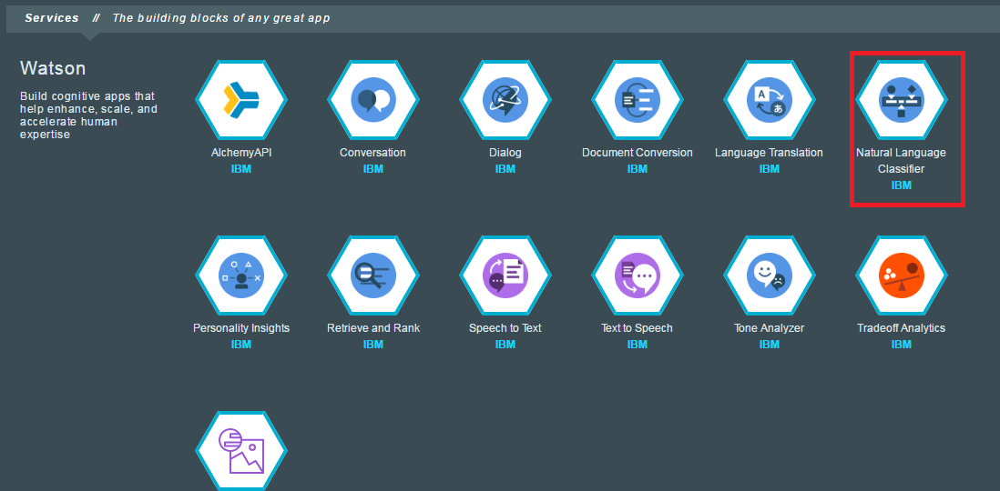
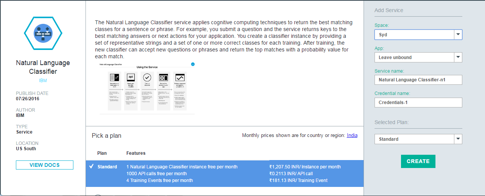
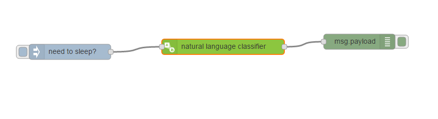
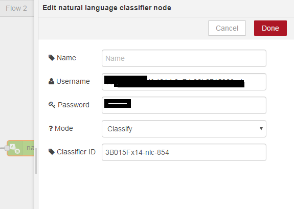
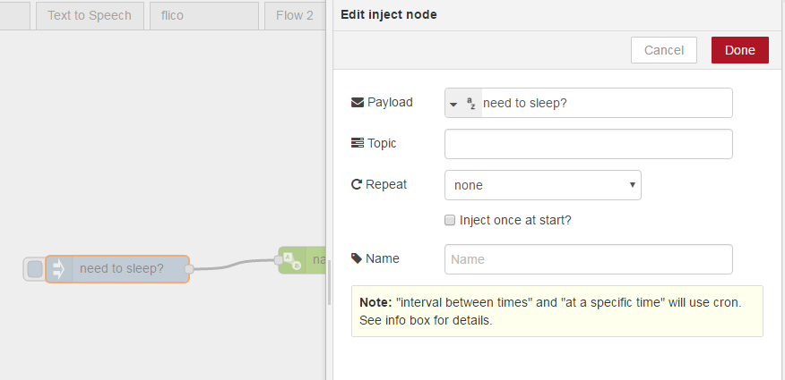
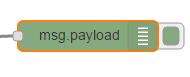
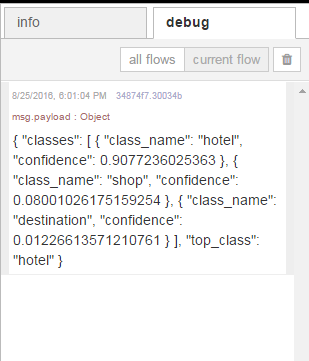

#Natural Language Classifier

The Natural Language Classifier (NLC) is a service that can be trained and it 
is useful to describe how to create the steps to use it since it offers some cognitive learning features. 

Within Bluemix you can create an **unbound instance** of the NLC Service, by selecting Natural Language Classifier
in the Bluemix catalog.




Download the training file [csv](train.csv)

Train Your Classifier
```
curl -u "{username}":"{password}" -F training_data=@train.csv -F training_metadata="{\"language\":\"en\",\"name\":\"My Classifier\"}" "https://gateway.watsonplatform.net/natural-language-classifier/api/v1/classifiers"
```
##Using the NLC Service from Node-RED

You need to use the existing boilerplate sample.  It should finally look like this


Drag a Natural Language Classifier (NLC) node to the palette and click it to edit



Add the right Inject node to the palette and connect it with NLC


Add the right Debug node to the palette and connect it from NLC


##Run the NLC Service from Node-RED
Trigger the Inject node and see the Debug Console



The flows for this part of the lab are here -> [flows](code.json)
