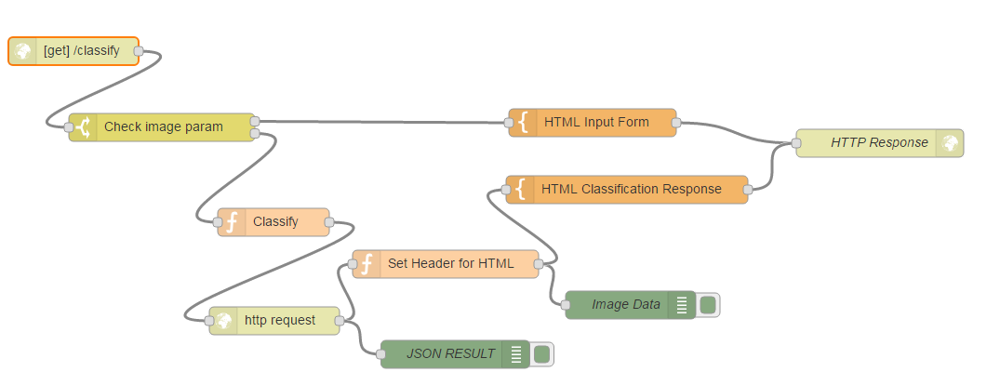
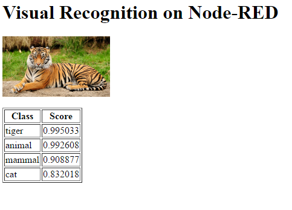

#  Lab: Watson Visual Recognition with Node-RED
## Overview
The Watson  Visual Recognition service allows to analyse the contents of an image and produce a series of text classifiers with a confidence index.

## Node-RED Watson Visual Recognition node
The Node-RED  node provides a very easy wrapper node that takes an image URL or binary stream as input, and produces a set of image labels as output.

## Watson Visual Recognition Flow construction
In this exercise, we will show how to simply generate the labels from an image URL.

### Prerequisites and setup
To get the service credentials automatically filled-in by Node-RED from the BlueMix credentials, the Visual Recognition Service should be bound to the Node-RED application in BlueMix.


Please refer to the [Node-RED setup lab](/introduction_to_node_red/README.md) for instructions.

### Building the flow
The flow will present a simple Web page with a text field where to input the image's URL, then submit it to Watson Visual Recognition, and output the labels that have been found on the reply Web page.

The nodes required to build this flow are:

 The first part of the classification flow, displays a form where you are prompted to enter an image url and a classifier id. The id comes from the training you 
completed previously and the image url is the new image that you want to check against your classifier.


Where HTML Input Form looks like 
```
<h1>Visual Recognition Demo on Node-RED</h1>
<h2>Type a image URL</h2>
<form  action="{{req._parsedUrl.pathname}}">
    Url: <input type="text" name="url"/><br/>
    Classifier id: <input type="text" name="classifier_id"/><br/>
    <input type="submit" value="Classify"/>
</form>
```

When the response from the form is returned and a url has been specified, then the application can start the process of 
classifying the image as specified in the image url.


If no url has been provided then the form is redisplayed
 


if a url has been provided then we pass control to a function node


that caches the image url and sets up a REST call to our classify API.

```
msg.imageurl = encodeURI(msg.payload.url)
msg.url="https://gateway-a.watsonplatform.net/visual-recognition/api/v3/classify?api_key={your_api_key}&url="+msg.imageurl+"&version=2016-05-19;
return msg;
```

The API is then called.


which will return a json object.


We then pass the reponse to a function


which sets the headers so that the browser will treat the response as HTML
```
msg.imageclasses = msg.payload;
msg.headers = {'Content-Type' : 'text/html'};
return msg;
```

The return html is then created


which makes use of mustache templating to iterate over the response and inject the image, classification and confidence
into the response.

```
<h1>Visual Recognition on Node-RED</h1>
{{#imageclasses}}
    {{#images}}
        <div></div>
        <div>{{image}}</div>
        <br/>
        <table border='1'>
            <thead>
                <tr><th>Class</th><th>Score</th></tr>
            </thead>
            <tbody>
            {{#classifiers}}
                {{#classes}}
                    <tr>
                        <td>
                            {{class}}
                        </td>
                        <td>
                            {{score}}
                        </td>
                    </tr>
                {{/classes}} 
             {{/classifiers}}
                {{^classifiers}}
                    <tr>
                        <td colspan="2">
                            No match to classification
                        </td>
                    </tr>
                {{/classifiers}}                
            </tbody>
        </table>
    {{/images}}    
{{/imageclasses}}
```

### Testing the flow
To run the web page, point your browser to  `/http://xxxx.mybluemix.net/classify` and enter the URL of some  image.
The URL of the pre-selected images can be copied to clipboard and pasted into the text field.

The Watson Visual Recognition API will return an array with the recognized features, which will be formatted in a HTML table by the template:


### Flow source
The complete flow is available at [Reco-Lab-WebPage](code.json).
